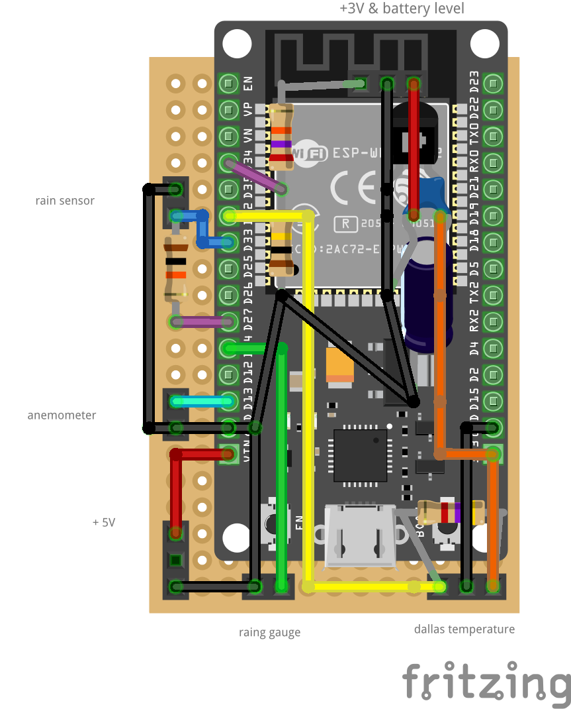

# Articles and post about Solar powered weather stations

- [https://www.opengreenenergy.com/solar-powered-wifi-weather-station-v3-0]
- [https://randomnerdtutorials.com/power-esp32-esp8266-solar-panels-battery-level-monitoring/]
- [https://github.com/BeardedTinker/SolarWS/blob/main/weather_station.yaml]

## Updated schematics for Solar panels and battery connectios

